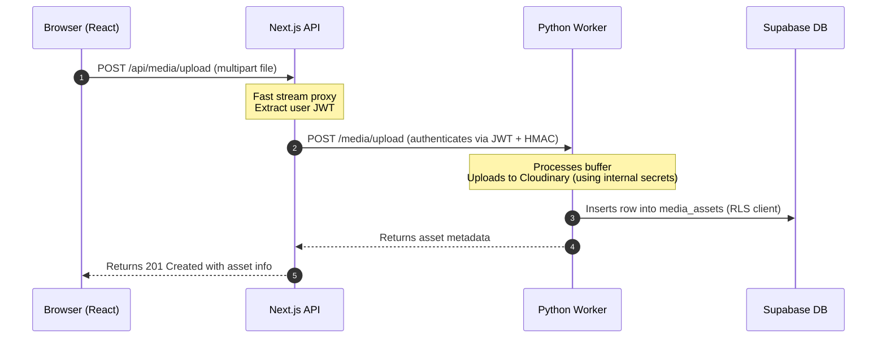
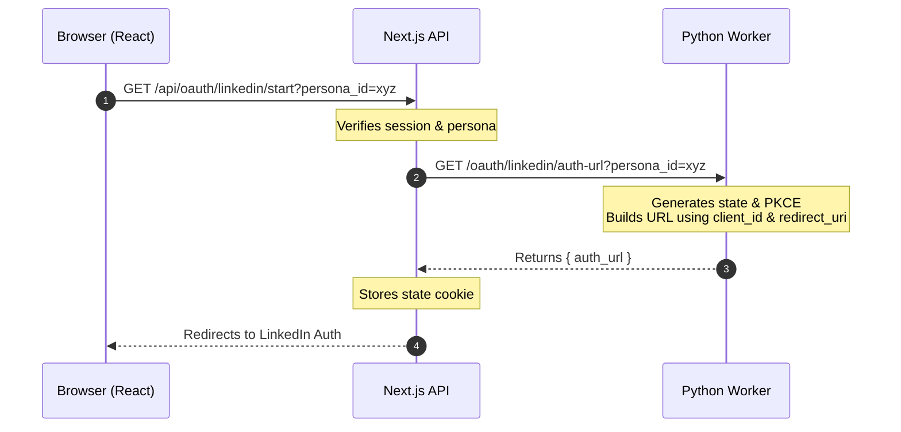
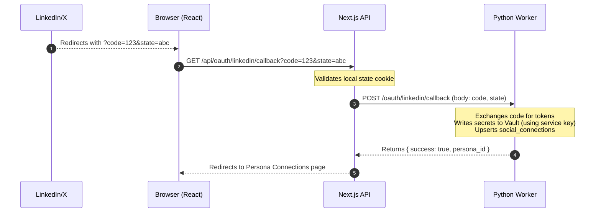

# Frontend-Backend Architectural Analysis: Services & Env Var Decoupling

SocialOS has successfully migrated major heavy operations (Playwright scraping, LLM campaign orchestration, manual publishing, and worker-driven cron jobs) to the Python FastAPI worker. However, several critical write/mutation routes, media storage steps, and highly sensitive credentials still reside on the Next.js frontend. 

This analysis details:
1. What functionalities/services are **still processed in the frontend (Next.js)** that should be migrated.
2. Why these remaining tasks force a massive set of **secret environment variables** to be declared in Next.js (Vercel).
3. The proposed **target architecture and request-flow design** to decouple them.
4. An actionable **step-by-step roadmap** to complete the transition.

---

## 1. Current State of the Next.js API Routes

A scan of the current Next.js `web/app/api` directory shows a clear separation between fully proxied thin routes and routes still doing direct database write processing:

### A. Fully Migrated (Thin Proxies to Worker)
These routes perform only JWT extraction, request signing (via HMAC), and forward all logic to the Python worker, which executes under user RLS:
*   `POST /api/ingest` & `GET /api/ingest/[job_id]`
*   `POST /api/campaigns` & `DELETE /api/campaigns/[id]`
*   `POST /api/campaigns/[id]/approve`
*   `POST /api/campaigns/[id]/cancel-scheduled`
*   `POST /api/campaigns/[id]/persona/[persona_id]/approve` / `/reject`
*   `POST /api/personas` & `PATCH /api/personas/[id]` & `DELETE /api/personas/[id]`
*   `POST /api/brand/config` & `POST /api/brand/voice-profile`
*   `POST /api/posts/[id]/publish`
*   `POST /api/posts/[id]/regenerate`

---

### B. Remaining Database Mutations inside Next.js (To Be Migrated)
These API routes still import files from `web/lib/db/*` and perform direct write operations to PostgreSQL:

| API Endpoint | Type | Current Direct DB Logic | Target Destination |
| :--- | :--- | :--- | :--- |
| `POST /api/posts/[id]/schedule` | Write | Validates date and updates `post_variants.status = 'scheduled'` directly | `POST /posts/{id}/schedule` |
| `POST /api/posts/[id]/cancel` | Write | Updates `post_variants.status = 'cancelled'` directly | `POST /posts/{id}/cancel` |
| `PATCH /api/posts/[id]` | Write | Directly edits the variant `body` via `updatePostVariant` | `PATCH /posts/{id}` |
| `PUT /api/posts/[id]/media` | Write | Modifies the `post_variant_media` join table directly via `setVariantMedia` | `PUT /posts/{id}/media` |
| `POST /api/posts/[id]/revisions` | Write | Calls `snapshotVariantBody` and updates `post_variants.body` during a revert | `POST /posts/{id}/revert` |
| `POST /api/schedule-slots` | Write | Directly inserts slots into `posting_schedules` via `createScheduleSlot` | `POST /schedule-slots` |
| `DELETE /api/schedule-slots/[id]` | Write | Deletes slots from `posting_schedules` via `deleteScheduleSlot` | `DELETE /schedule-slots/{id}` |

---

### C. Direct Third-Party / Secret Integrations in Next.js

These represent the greatest security concern and block environment variable cleanup during Next.js deployments:

#### 1. Direct Media Upload (`POST /api/media/upload`)
*   **What it does:** Reads user-uploaded file bytes, processes buffers, and uses `web/lib/adapters/cloudinary.ts` to upload the file to Cloudinary. It then writes a `media_assets` record to PostgreSQL.
*   **Env Vars Needed in Web:** `CLOUDINARY_CLOUD_NAME`, `CLOUDINARY_API_KEY`, `CLOUDINARY_API_SECRET`.
*   **Why it's bad:** Next.js serverless functions have standard timeouts, and handling raw binary buffers and third-party SDK calls consumes valuable memory and execution time.

#### 2. OAuth Callback & Vault Integrations (`/api/oauth/linkedin/callback` & `/api/oauth/x/callback`)
*   **What it does:** Next.js receives the OAuth `code` and `state`, exchanges it for access tokens with LinkedIn/X, spins up the **bypassed-RLS Supabase Admin Client**, writes the raw tokens directly to **Supabase Vault** (`createSecret`), and inserts a row into `social_connections` via an admin client bypass.
*   **Env Vars Needed in Web:** `SUPABASE_SERVICE_ROLE_KEY` (highly sensitive!), `LINKEDIN_CLIENT_ID`, `LINKEDIN_CLIENT_SECRET`, `X_CLIENT_ID`, `X_CLIENT_SECRET`.
*   **Why it's bad:** Having `SUPABASE_SERVICE_ROLE_KEY` in the Vercel env allows any code execution vulnerability in Next.js to bypass RLS and read the entire database.

---

## 2. Decoupling the Environment Variables

Currently, Next.js checks **15 environment variables** inside `web/lib/env.ts` at startup. If any are missing, the build fails.

Here is how we can reduce the required Next.js environment variables to a **safe, minimalist set of 4 variables**:

### Env Var Migration Breakdown

| Environment Variable | Category | Current Consumer | Shifting to Worker? | Can be removed from Web? |
| :--- | :--- | :--- | :--- | :--- |
| `NEXT_PUBLIC_SUPABASE_URL` | Supabase | Web (Auth/Client reads) | No (Used by client app) | **No** (Keep in Web) |
| `NEXT_PUBLIC_SUPABASE_ANON_KEY` | Supabase | Web (Auth/Client reads) | No (Used by client app) | **No** (Keep in Web) |
| `WORKER_URL` | Worker | Web (`worker-client.ts`) | No (Web needs to know endpoint) | **No** (Keep in Web) |
| `WORKER_SHARED_SECRET` | Worker | Web (Signing requests) | No (Proves Web is caller) | **No** (Keep in Web) |
| `CRON_SECRET` | Cron | None (Already migrated) | Yes (Worker verifies) | **Yes!** (Safe to remove from Web) |
| `SUPABASE_SERVICE_ROLE_KEY` | Supabase | Web (`admin.ts` for Vault) | Yes (Worker already uses it) | **Yes!** (Safe to remove from Web) |
| `CLOUDINARY_CLOUD_NAME` | Media | Web (`cloudinary.ts`) | Yes (Worker already uses it) | **Yes!** (Safe to remove from Web) |
| `CLOUDINARY_API_KEY` | Media | Web (`cloudinary.ts`) | Yes (Worker already uses it) | **Yes!** (Safe to remove from Web) |
| `CLOUDINARY_API_SECRET` | Media | Web (`cloudinary.ts`) | Yes (Worker already uses it) | **Yes!** (Safe to remove from Web) |
| `LINKEDIN_CLIENT_ID` | OAuth | Web (Exchange / Authorize) | Yes (Moved to Worker) | **Yes!** (Safe to remove from Web) |
| `LINKEDIN_CLIENT_SECRET` | OAuth | Web (Exchange) | Yes (Moved to Worker) | **Yes!** (Safe to remove from Web) |
| `LINKEDIN_REDIRECT_URI` | OAuth | Web (Authorization flow) | Yes (Moved to Worker) | **Yes!** (Safe to remove from Web) |
| `X_CLIENT_ID` | OAuth | Web (Exchange / Authorize) | Yes (Moved to Worker) | **Yes!** (Safe to remove from Web) |
| `X_CLIENT_SECRET` | OAuth | Web (Exchange) | Yes (Moved to Worker) | **Yes!** (Safe to remove from Web) |
| `X_REDIRECT_URI` | OAuth | Web (Authorization flow) | Yes (Moved to Worker) | **Yes!** (Safe to remove from Web) |

> [!IMPORTANT]
> By completing this migration, the Next.js production deployment will **never** touch the `SUPABASE_SERVICE_ROLE_KEY`, platform secrets, or Cloudinary API keys. This radically hardens the application security posture.

---

## 3. How the New Request Flows Look

### A. Media Upload Flow (No Web Cloudinary dependency)
Instead of handling image uploads in Next.js, the frontend sends a signed proxy request to the worker backend.

---

### B. OAuth Start Flow (No Web Redirect/ID Config)
Since Next.js doesn't need to know the Client IDs to redirect, it asks the worker to construct the authorization URL.

---

### C. OAuth Callback Flow (No Web Vault/Service-Role Bypasses)
While the redirect callback **must** hit Next.js (due to registered domains on LinkedIn/X), Next.js immediately delegates the code exchange and DB/Vault writing to the worker.

---

## 4. Implementation Roadmap

To accomplish this safely, the migration should be completed in three distinct phases:

### Phase 1: Porting Post & Schedule Mutations
**Target:** Remove all database writes (`updatePostVariant`, `createScheduleSlot`, `deleteScheduleSlot`) from Next.js.
*   **Step 1.1:** Add `/posts/{id}/schedule`, `/posts/{id}/cancel`, `/posts/{id}/revert`, and `/posts/{id}/media` (PUT) endpoints in the FastAPI worker (`worker/routes/posts.py`).
*   **Step 1.2:** Add `/schedule-slots` (POST) and `/schedule-slots/{id}` (DELETE) endpoints in `worker/routes/schedule_slots.py`.
*   **Step 1.3:** Replace the Next.js routes with standard thin proxies calling `workerFetch`.

### Phase 2: Shifting Media Upload
**Target:** Eliminate Cloudinary dependencies in Next.js.
*   **Step 2.1:** Implement `/media/upload` POST endpoint in Python worker using the existing Cloudinary pipeline adapter.
*   **Step 2.2:** Update Next.js `media/upload` route to proxy files to the worker using standard multipart form-data forwarding.
*   **Step 2.3:** Delete `web/lib/adapters/cloudinary.ts` and related client-side configuration.

### Phase 3: Moving OAuth Handlers & Vault Bypasses
**Target:** Eliminate `SUPABASE_SERVICE_ROLE_KEY` and OAuth Client secrets from Next.js.
*   **Step 3.1:** Move the platform OAuth adapters (LinkedIn/X `exchangeCodeForTokens`, `getUserInfo`) to Python.
*   **Step 3.2:** Implement `/oauth/{platform}/auth-url` and `/oauth/{platform}/callback` in Python worker.
*   **Step 3.3:** Update Next.js OAuth start/callback routes to delegate processing to the worker and handle redirects.
*   **Step 3.4:** Remove `SUPABASE_SERVICE_ROLE_KEY` and all OAuth/Cloudinary keys from `web/lib/env.ts` and Next.js deployment configs.

---

## 5. Summary of the Decoupled Next.js Setup

| Feature | Next.js Role (Post-Migration) | Python Worker Role (Post-Migration) |
| :--- | :--- | :--- |
| **Auth & Session** | ✅ Manages Supabase session cookie / Middleware | ❌ Stateless JWT validation |
| **Data Reads (GET)** | ✅ Calls Supabase RLS directly (fast pages) | ❌ Untouched (stays stateless) |
| **Mutations (POST/PUT/PATCH)** | 🔄 Thin API proxy forwards request with JWT | ✅ Updates database under RLS |
| **OAuth (LinkedIn/X)** | 🔄 Callback proxy redirects only | ✅ Exhanges tokens & writes Vault secrets |
| **File Storage** | 🔄 Buffer forwarding proxy | ✅ Uploads to Cloudinary |
| **Service Role Key** | ❌ None (No direct Vault or bypass writes) | ✅ Reads Vault (Publishing), writes Vault (OAuth) |
