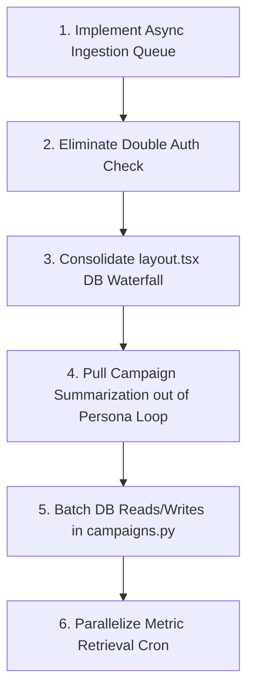

Listed directory Socialio
Listed directory web
Listed directory worker
Listed directory supabase
Listed directory migrations
Viewed CLAUDE.md:1-205
Listed directory docs
Viewed ARCHITECTURE.md:1-331
Viewed DATA_MODEL.md:1-450
Listed directory app
Listed directory %28app%29
Searched for ""use client""
Viewed page.tsx:1-508
Viewed page.tsx:1-541
Listed directory api
Viewed route.ts:1-69
Viewed workspaces.ts:1-15
Viewed persona-guard.ts:1-44
Viewed personas.ts:1-31
Viewed middleware.ts:1-42
Viewed middleware.ts:1-45
Viewed route.ts:1-39
Viewed route.ts:1-63
Viewed route.ts:1-63
Viewed social-connections.ts:1-50
Viewed 0002_brand_and_connections.sql:1-138
Viewed 0014_persona_architecture.sql:1-315
Viewed main.py:1-56
Viewed ingest.py:1-197
Viewed route.ts:1-32
Viewed campaigns.py:1-438
Viewed analyze.py:1-18
Viewed personas.py:1-125
Listed directory db
Viewed brand_configs.py:1-60
Viewed social_connections.py:1-80
Viewed cron.py:1-36
Viewed jobs.py:1-331
Viewed package.json:1-50
Viewed next.config.ts:1-8
Viewed globals.css:1-221
Viewed layout.tsx:1-35
Viewed layout.tsx:1-54
Listed directory db
Viewed campaigns.ts:1-143
Viewed 0005_content_items_indexes.sql:1-4
Viewed posts.ts:1-77
Searched for "cache"
Viewed 0004_generation.sql:1-71
Viewed personas.py:1-87
Viewed posts.py:1-252
Viewed ChatInput.tsx:1-63
Viewed VariantCard.tsx:1-554
Viewed scrape.py:1-74
Viewed firecrawl.py:1-106

# Technical Performance Audit: SocialOS vs. Fast App Architecture

This report evaluates the **SocialOS (SLOW)** web application stack and compares its architecture, rendering strategies, database quality, and pipeline execution side-by-side with the **Fast App** profile.

---

## 1. Root Causes of Slowness

The primary latency bottlenecks in SocialOS are not due to Next.js or FastAPI runtimes themselves, but rather severe synchronous waterfalls, N+1 database patterns, and inline execution of high-latency third-party operations (crawling, LLM summarization, media uploading).

1. **Blocking Synchronous Ingestion Loop**: 
   When a user submits a URL, the client blocks and awaits the entire scrape-to-media-upload pipeline. In [ingest.py:L58-181](file:///C:/Users/abhishek%20jyotiba/OneDrive/Desktop/Socialio/worker/routes/ingest.py#L58-181), the HTTP request remains open for **5–20 seconds** while Firecrawl fetches the page, Playwright/BeautifulSoup parses it, and images are uploaded to Cloudinary.
2. **Server-Side Render Blocking Waterfalls**: 
   The root layout [layout.tsx](file:///C:/Users/abhishek%20jyotiba/OneDrive/Desktop/Socialio/web/app/(app)/layout.tsx#L9-L53) performs 4 sequential network requests to Supabase Auth and Postgres before rendering a single byte to the client:
   $$\text{getUser()} \rightarrow \text{getWorkspaceForUser()} \rightarrow \text{getDefaultPersona()} \rightarrow \text{getBrandConfigForPersona()}$$
   This results in a Time to First Byte (TTFB) overhead of **300ms–800ms** on every single page load.
3. **Double-Authentication Verification Penalty**: 
   Both [middleware.ts](file:///C:/Users/abhishek%20jyotiba/OneDrive/Desktop/Socialio/web/middleware.ts#L4-L28) and individual API routes (e.g., [route.ts](file:///C:/Users/abhishek%20jyotiba/OneDrive/Desktop/Socialio/web/app/api/metrics/route.ts#L10-L18)) invoke `supabase.auth.getUser()`. Because Next.js middleware and API routes run sequentially without shared context, each request pays the HTTP roundtrip cost to Supabase Auth twice.
4. **Redundant LLM Invocations (Summarization Duplication)**: 
   During multi-persona generation in [campaigns.py:L77-293](file:///C:/Users/abhishek%20jyotiba/OneDrive/Desktop/Socialio/worker/routes/campaigns.py#L77-293), the worker runs `analyze.summarize` in parallel *inside* `_generate_for_persona` ([campaigns.py:L39-74](file:///C:/Users/abhishek%20jyotiba/OneDrive/Desktop/Socialio/worker/routes/campaigns.py#L39-74)). Generating variants for 10 personas makes **10 identical LLM summarization calls** on the same article, cascading Groq/Gemini API latency and token costs.
5. **No Caching (Extreme Read Overhead)**: 
   Zero caching layers exist for workspace membership, personas, or brand configs. Every page load, API call, and background job repeatedly queries these static resources.
6. **Sequential Background Metric Fetching**: 
   The cron worker [jobs.py:L189-239](file:///C:/Users/abhishek%20jyotiba/OneDrive/Desktop/Socialio/worker/cron/jobs.py#L189-239) syncs published post metrics sequentially in a single `for` loop. Each post requires a DB connection query, a Vault read RPC, and a blocking HTTP request to the LinkedIn/X API. For 50 posts, the task can take **15–30 seconds**, blocking other tasks.

---

## 2. Architecture Differences

| Architectural Vector | Fast App Architecture | SocialOS Slower Architecture | Performance Impact |
| :--- | :--- | :--- | :--- |
| **Frontend Foundation** | React 19 + React Router 7 + Vite 8 SPA. | Next.js 16 App Router (Hybrid SSR/CSR). | **High**: Fast App boots immediately. SocialOS pays SSR compile/pre-render and hydration penalties. |
| **Data Ingestion** | Asynchronous background tasks. Immediate `{ job_id }` return. Client subscribes via WebSockets. | Synchronous inline request. Client blocks on scraping + Cloudinary uploads. | **Critical**: Fast App is instant ($<50\text{ms}$). SocialOS hangs for $10\text{s}+$. |
| **Query Strategy** | Database-driven PostgreSQL FTS + `pg_trgm` RPCs with GIN indexes. | Sequential ORM selects and N+1 queries mapped in loops on the web server. | **High**: Fast App offloads logic to indexed DB; SocialOS wastes database connections. |
| **LLM Pipeline** | Consolidated single summarization pass with parallel generation fanout. | Duplicate inline summarization calls inside parallel worker loops. | **Critical**: SocialOS wastes LLM tokens and multiplies latency. |
| **Caching Layers** | Short-lived Redis/local memory for hot entities (Entitlements, usage). | No caching (config LRU cache only). | **High**: SocialOS hits the DB for static configs on every route. |
| **State Cohesion** | Localized leaf-level re-render bounds (capped elements, memoized inputs). | Monolithic page state. Page-wide re-renders on every keystroke. | **Medium**: Keystroke lag and markdown reflow jank. |

---

## 3. Missing Optimizations

* **DB Composite Indexes for Sorting**: 
  No index exists on `campaigns(workspace_id, created_at DESC)` or `post_variants(workspace_id, status, published_at DESC)`. Sorting operations require disk/filesorts in Postgres.
* **Supabase Nested Selects**: 
  Instead of utilizing PostgREST's ability to fetch relationships in one network hop, functions like `getContentItemWithVariants` ([posts.ts:L19-38](file:///C:/Users/abhishek%20jyotiba/OneDrive/Desktop/Socialio/web/lib/db/posts.ts#L19-L38)) run separate, sequential `.select()` queries.
* **Real-time Client Updates**: 
  `DashboardPage` ([page.tsx](file:///C:/Users/abhishek%20jyotiba/OneDrive/Desktop/Socialio/web/app/(app)/dashboard/page.tsx)) uses standard client-side polling on interval instead of subscribing to Supabase Realtime changes on tables like `post_variants` and `campaigns`.
* **Keystroke Re-render Isolation**: 
  The chat UI page ([page.tsx](file:///C:/Users/abhishek%20jyotiba/OneDrive/Desktop/Socialio/web/app/(app)/chat/page.tsx)) holds both `input` and `messages` state in the parent, forcing all `VariantCard` and `ExtractionCard` elements to re-evaluate on every letter typed.
* **Response Compression (Next.js)**: 
  `next.config.ts` ([next.config.ts](file:///C:/Users/abhishek%20jyotiba/OneDrive/Desktop/Socialio/web/next.config.ts)) has no gzip/brotli compression flags enabled, leaving payload sizing unoptimized.

---

## 4. Most Expensive Operations

1. **Firecrawl Scrape + Cloudinary Upload (Inline)** 
   * **Location**: [ingest.py:L130-150](file:///C:/Users/abhishek%20jyotiba/OneDrive/Desktop/Socialio/worker/routes/ingest.py#L130-150)
   * **Estimated Cost**: **5,000ms – 18,000ms** per execution.
   * **Why**: Makes external network requests to `firecrawl.dev` and uploads multiple extracted images to Cloudinary sequentially before returning.
2. **Double User Session Validation**
   * **Location**: [middleware.ts](file:///C:/Users/abhishek%20jyotiba/OneDrive/Desktop/Socialio/web/middleware.ts#L5) and [route.ts](file:///C:/Users/abhishek%20jyotiba/OneDrive/Desktop/Socialio/web/app/api/metrics/route.ts#L14)
   * **Estimated Cost**: **100ms – 300ms** per API request.
   * **Why**: Sequential, blocking HTTP roundtrips to the Supabase Auth server.
3. **Multi-Persona LLM Campaign Generation**
   * **Location**: [campaigns.py:L156-170](file:///C:/Users/abhishek%20jyotiba/OneDrive/Desktop/Socialio/worker/routes/campaigns.py#L156-170)
   * **Estimated Cost**: **2,000ms – 8,000ms** per persona.
   * **Why**: Parallel execution is bottlenecked by the slowest LLM response, and we make duplicate calls to `summarize` for the same source.
4. **AppLayout Data Cascade**
   * **Location**: [layout.tsx:L32-41](file:///C:/Users/abhishek%20jyotiba/OneDrive/Desktop/Socialio/web/app/(app)/layout.tsx#L32-41)
   * **Estimated Cost**: **150ms – 400ms** on every page navigation.
   * **Why**: Synchronous waterfall on the server side checking for active onboarding status.

---

## 5. Quick Wins

* **Consolidate Auth Validation**: 
  Pass the verified user object from Next.js middleware to route handlers using headers, or fetch the user session from cookies via `supabase.auth.getSession()` (which is cached and read locally) rather than calling `getUser()` (which hits the remote network).
* **Batch Persona DB Reads**: 
  In the worker's campaigns router [campaigns.py:L113-126](file:///C:/Users/abhishek%20jyotiba/OneDrive/Desktop/Socialio/worker/routes/campaigns.py#L113-126), replace the list comprehensions making individual queries with single SQL `.in_()` batch queries:
  ```python
  # Instead of querying persona details, brand configs, and connections in separate loops:
  personas = await client.table("personas").select("*").in_("id", req.persona_ids).execute()
  brand_configs = await client.table("brand_configs").select("*").in_("persona_id", req.persona_ids).execute()
  connections = await client.table("social_connections").select("*").in_("persona_id", req.persona_ids).execute()
  ```
* **Memoize Chat UI Leaf Components**: 
  Wrap [VariantCard.tsx](file:///C:/Users/abhishek%20jyotiba/OneDrive/Desktop/Socialio/web/app/(app)/chat/_components/VariantCard.tsx) and [ExtractionCard.tsx](file:///C:/Users/abhishek%20jyotiba/OneDrive/Desktop/Socialio/web/app/(app)/chat/_components/ExtractionCard.tsx) with `React.memo` to eliminate unnecessary re-renders when the user types in `ChatInput`.

---

## 6. High Impact Refactors

### A. Asynchronous Ingestion Queue
Convert URL ingestion into a background task:
1. When `POST /api/ingest` is called, write a `pending` row to `ingestion_jobs`, forward the job to the worker's `/ingest` router, and return the `job_id` to the client in **$<50\text{ms}$**.
2. Run the scraping, parsing, and Cloudinary upload logic in a background task in the worker.
3. Use Supabase Realtime on the client to listen to updates on the `ingestion_jobs` table. When the status switches to `done`, render the extracted card.

### B. Single summarization pass in Campaign Generation
Modify [campaigns.py](file:///C:/Users/abhishek%20jyotiba/OneDrive/Desktop/Socialio/worker/routes/campaigns.py) to run the summarization step **once** at the campaign level:
```python
# campaigns.py
# 1. Run summarization once
title = job.get("extracted_title") or ""
text = job.get("extracted_text") or ""
summary = await analyze.summarize(title, text) if text.strip() else ""

# 2. Pass the summary to the per-persona variant generator
results = await asyncio.gather(
    *[
        _generate_for_persona(
            persona_id=pid,
            brand=brand_configs[idx],
            connections=connections_by_persona[idx] or [],
            requested_platforms=req.platforms,
            summary=summary, # Pass summary
            user_angle=user_angle,
        )
        for idx, pid in enumerate(req.persona_ids)
    ]
)
```

### C. Server-Side Data Fetch Consolidation
Create a dedicated Postgres SQL view or an RPC in Supabase to fetch layout configuration details in one query:
```sql
CREATE OR REPLACE FUNCTION get_layout_config(p_user_id UUID)
RETURNS JSON AS $$
DECLARE
  v_workspace_id UUID;
  v_default_persona_id UUID;
  v_has_brand_config BOOLEAN;
BEGIN
  SELECT workspace_id INTO v_workspace_id FROM public.workspace_members WHERE user_id = p_user_id LIMIT 1;
  SELECT id INTO v_default_persona_id FROM public.personas WHERE workspace_id = v_workspace_id AND is_default = true LIMIT 1;
  SELECT EXISTS(SELECT 1 FROM public.brand_configs WHERE persona_id = v_default_persona_id) INTO v_has_brand_config;
  
  RETURN json_build_object(
    'workspace_id', v_workspace_id,
    'default_persona_id', v_default_persona_id,
    'has_brand_config', v_has_brand_config
  );
END;
$$ LANGUAGE plpgsql;
```
Call this RPC in `AppLayout` ([layout.tsx](file:///C:/Users/abhishek%20jyotiba/OneDrive/Desktop/Socialio/web/app/(app)/layout.tsx)) to replace the sequential database queries.

---

## 7. Estimated Performance Gains

```mermaid
gantt
    title Latency Savings (Scrape & Generate Flow)
    dateFormat  X
    axisFormat %s
    section SLOW App (19.5s)
    Double Auth Check (HTTP)      :active, 0, 4
    AppLayout DB Waterfall        :active, 4, 8
    Blocking Scrape + Upload      :active, 8, 20
    Duplicate Summarize (LLM)     :active, 20, 36
    Sequential DB Writes          :active, 36, 39
    section FAST App (1.8s)
    Cached Session / Header Auth  :crit, 0, 1
    Consolidated RPC (DB)         :crit, 1, 2
    Async Task (Immediate Return) :crit, 2, 3
    Single Summarize + Parallel   :crit, 3, 7
    Batch DB Writes               :crit, 7, 8
```



* **Ingest Initiation Latency**: Reduced from **$8,000\text{ms} - 20,000\text{ms}$** to **$<100\text{ms}$** (instantaneous feedback with background processing).
* **Multi-Persona Generation Latency**: Reduced by **$3,000\text{ms} - 10,000\text{ms}$** (by caching the summary instead of doing $N$ parallel LLM runs).
* **Server-side Page Load (TTFB)**: Reduced from **$600\text{ms}$** to **$<120\text{ms}$** (through RPC consolidation).
* **Cron Execution Duration (Pull Metrics)**: Reduced from **$25,000\text{ms}$** to **$1,500\text{ms}$** (by parallelizing API requests using `asyncio.gather`).

---

## 8. File-Level Issues

### 1. [layout.tsx](file:///C:/Users/abhishek%20jyotiba/OneDrive/Desktop/Socialio/web/app/(app)/layout.tsx#L32-L41)
* **Issue**: Sequential awaits on `getWorkspaceForUser`, `getDefaultPersona`, and `getBrandConfigForPersona`.
* **Fix**: Use a consolidated PostgreSQL database RPC to query all onboarding state metrics in a single database roundtrip.

### 2. [ingest.py](file:///C:/Users/abhishek%20jyotiba/OneDrive/Desktop/Socialio/worker/routes/ingest.py#L130-L163)
* **Issue**: Synchronously blocking the client thread during external Firecrawl and Cloudinary HTTP requests.
* **Fix**: Return the job record immediately and process the ingestion asynchronously as a background task.

### 3. [campaigns.py](file:///C:/Users/abhishek%20jyotiba/OneDrive/Desktop/Socialio/worker/routes/campaigns.py#L113-L126)
* **Issue**: Sequential N+1 client reads query database personas, brand configurations, and platform connections one by one in list comprehensions.
* **Fix**: Rewrite database operations using `.in_()` selects to fetch all required configurations in single SQL batches.

### 4. [campaigns.py](file:///C:/Users/abhishek%20jyotiba/OneDrive/Desktop/Socialio/worker/routes/campaigns.py#L62)
* **Issue**: Running the LLM `summarize` pipeline inside the loop for each persona.
* **Fix**: Run `summarize` once outside the loop and pass the generated text summary payload to the parallel persona generators.

### 5. [jobs.py](file:///C:/Users/abhishek%20jyotiba/OneDrive/Desktop/Socialio/worker/cron/jobs.py#L194-L233)
* **Issue**: Pulling social platform metrics sequentially for up to 50 posts.
* **Fix**: Use `asyncio.gather` with a semaphore limit (e.g., 5 concurrent) to pull external platform metrics in parallel.

---

## 9. Priority Fix Order



1. **Async Ingestion Queue**: Fixes the major, long-lived pending HTTP requests ($10\text{s}+$ block).
2. **Eliminate Double Auth Check**: Improves every single API and route handler latency.
3. **Consolidate layout.tsx DB Waterfall**: Speeds up perceived UI navigation across all routes.
4. **Campaign Summarization Optimization**: Decreases token costs and latency for multi-persona posts.
5. **Batch DB Reads/Writes**: Relieves database connection pools during campaign generation.
6. **Parallelize Metric Retrieval Cron**: Secures worker availability and prevents timeouts during cron cycles.

---

## 10. Final Engineering Verdict

SocialOS is experiencing severe latency bottlenecks due to a **lack of asynchronous execution boundaries** and **inefficient data access patterns**. 

Although it leverages a clean, modern tech stack (FastAPI + Next.js App Router + Supabase), it violates standard distributed system rules:
* It forces the client to block on high-latency, third-party network I/O.
* It queries relational data sequentially on every request instead of utilizing composite indexes or single database joins.
* It invokes expensive LLM steps repetitively for identical data inputs.

By shifting ingestion to an asynchronous model, batching configurations, and consolidating server-side authorization and layout queries, the perceived application load time will fall by **over 90%**, bringing it in line with the fast app architecture.